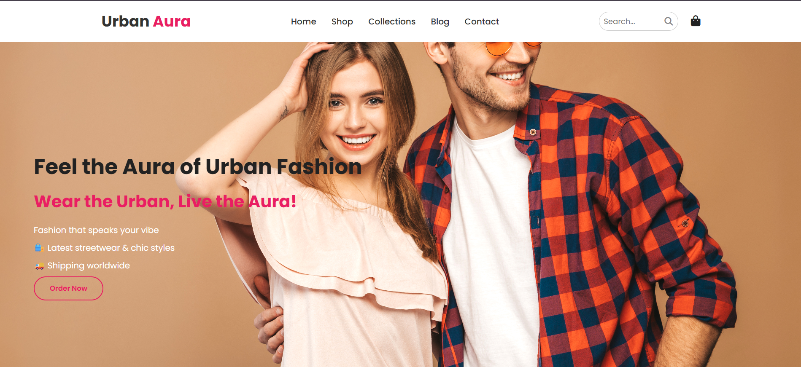

# 🌆 UrbanAura – Responsive & Interactive Fashion Website

**UrbanAura** is a fully responsive and user-interactive fashion website designed with HTML, CSS, and JavaScript. It delivers a modern shopping experience with smooth animations, intuitive navigation, and real-time search.

## ✨ Key Features

- 🛒 Interactive Shopping Cart
- 🔍 Real-time Search Filter
- 📱 Mobile-Responsive Hamburger Menu
- ✨ Smooth Scroll Animations
- 🎨 Modern & Clean UI Design
- ⚡ Fast and Lightweight

## 🚀 Live Website

👉 [UrbanAura on GitHub Pages](https://JeevanGowdaN.github.io/UrbanAura/)

## 📷 Screenshots

_Add screenshots or UI previews if desired._

## 📁 Project Structure

UrbanAura/
├── index.html # Main HTML file 
├── style.css # Custom styling 
├── script.js # JavaScript functionality 
└── /assets # Images, icons, fonts, etc. 

## 🛠️ Tech Stack

- HTML5
- CSS3 (Responsive Design)
- JavaScript

## 🤝 Contribution

This project is part of my personal portfolio.  
Feel free to fork, suggest improvements, or use it as inspiration!

## 📬 Contact

- **Name:** Jeevan Gowda N  
- **GitHub:** [JeevanGowdaN](https://github.com/JeevanGowdaN)
